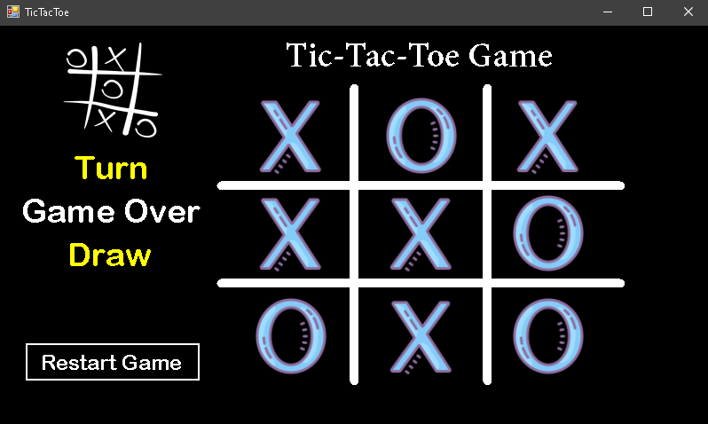

# 🎮 Tic-Tac-Toe Game - C# WinForms

A simple and fully functional Tic-Tac-Toe (X/O) desktop game built using **C# and Windows Forms**.  
The game supports two-player mode, automatic turn switching, win/draw detection, and a restart button.

## 🖼️ Screenshots

### 🟦 Main Screen

### 🔁 Draw

### 🏆 Player Wins

## ✅ Features

- Two-player game (Player 1 vs Player 2)
- Turn indicator
- Win and draw detection
- Restart button to reset the board
- Clean and modern UI

## 🛠️ Technologies Used

- C#
- Windows Forms (.NET Framework)

